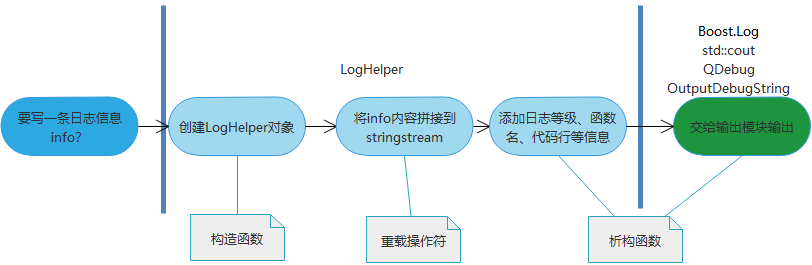

**C++日志模块主要特点如下**：

+ 动态链接库方式提供模块，非嵌入式；

- 支持多种不同的输出目的地，满足：
  - 输出到本地文件，支持按日期存储，支持按大小回滚；
  - 支持rsyslog协议，以将日志发往远程日志服务器
- 保留C++标准输出的习惯，如Log(kDebug) << "aaa" << 1<<std::endl;
- 支持C语言printf输出，如LOG2(kErr, "%s, %d", "test log", 100);

**日志模块的设计**：

- 主要是利用了C++构造和自动析构的机制，并重载<<操作符来保留使用习惯；
- 在析构构造函数中，组织消息拼接；
- 根据使用的宏将拼接好的消息交给不同日志输出模块
- 借鉴github的Boost.Log封装，[boost_log_example](https://github.com/contaconta/boost_log_example) 和 [simpleLogger](https://github.com/gklingler/simpleLogger）

**写文件模块的设计**：

引入[concurrentqueue]( https://github.com/cameron314/concurrentqueue)消息队列

如上图，`构造函数`、`重载操作符`流程与loghelper类似，不同的是`析构函数`阶段

+ 判断是否开启消息队列独立写线程，如果开启，则将消息publish到消息队列；
+ 否则，直接加锁(mutex)写文件。